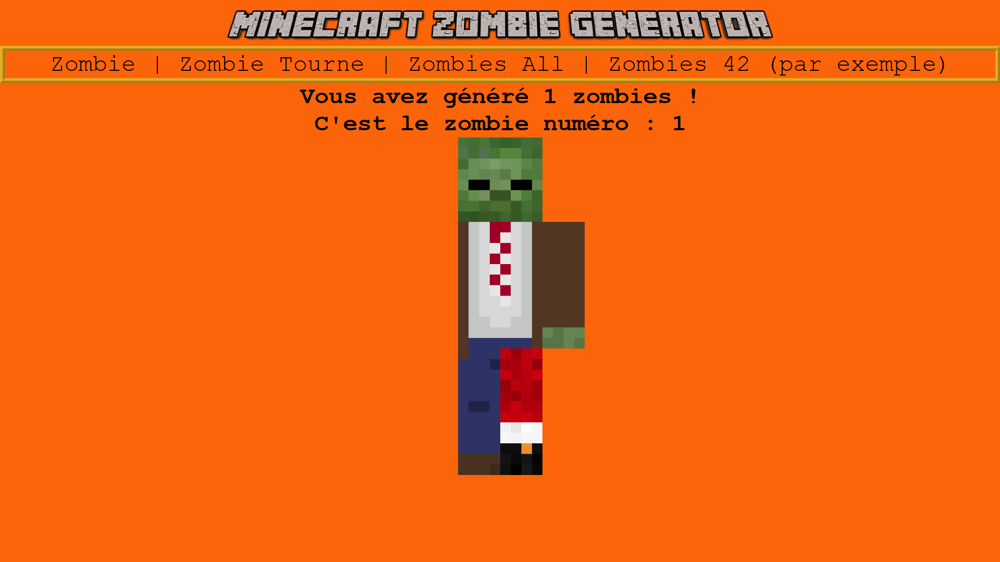
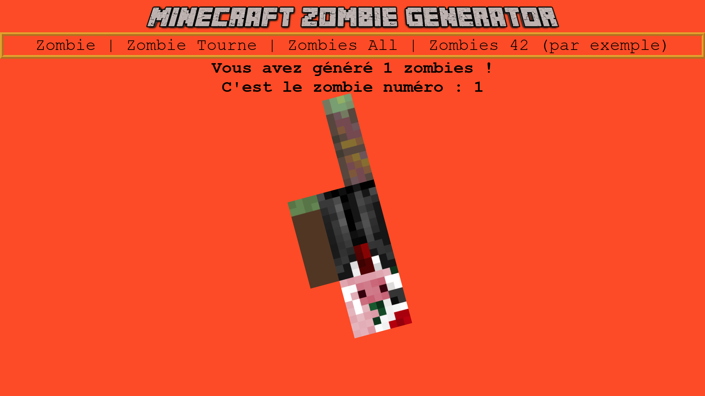

# zombiesGenerator# Zombie Generator Web App

Une application Flask modulaire (avec Blueprint) permettant de générer des personnages zombies de manière aléatoire ou exhaustive, en assemblant différentes parties du corps.

## Fonctionnalités

- **Génération aléatoire** d'un ou plusieurs zombies (`/zombie`, `/zombietourne`, `/zombies/<nbr>`).
- **Génération de toutes les combinaisons** possibles (`/zombiesall`).
- Animation CSS (zoom, rotation, transition de couleur de fond).
- **Architecture** basée sur un Blueprint pour séparer la logique de génération.

## Prérequis

- Docker (optionnel)
- Python 3.9+
- pip

## Installation

### Avec Docker Compose

```bash
git clone <URL_DU_DEPOT>
cd zombiesGenerator
docker compose up -d
```

L'application sera disponible sur : `http://localhost:8081`

### Sans Docker

```bash
git clone <URL_DU_DEPOT>
cd zombiesGenerator
python -m venv venv
source venv/bin/activate  # Linux/Mac
venv\Scripts\activate     # Windows
pip install -r requirements.txt
export FLASK_APP=app.py
flask run --host=0.0.0.0 --port=8080
```

Lancer ensuite votre navigateur sur `http://localhost:8080`.

## Structure du projet

```
zombiesGenerator/          # Racine du projet
├── app.py                 # Application principale, enregistrement du Blueprint
├── compose.yml            # Configuration Docker Compose
├── requirements.txt       # Dépendances Python
├── blueprints/            # Module Blueprint "Zombies"
│   ├── Zombies.py
│   └── ZombiesNonOptimized.py
├── static/                # Fichiers statiques (CSS, images)
│   ├── css/style.css
│   └── images/
│       ├── header/SplashScreen.png
│       ├── head/1.png ...
│       ├── body/1.png ...
│       ├── L_arm/1.png ...
│       ├── R_arm/1.png ...
│       ├── L_leg/1.png ...
│       └── R_leg/1.png ...
└── templates/             # Templates Jinja2
    ├── socle/base.jinja   # Layout générique
    └── zombies.jinja      # Template de rendu des zombies
```

## Routes disponibles

| URL                   | Description                                      |
|-----------------------|--------------------------------------------------|
| `/`                   | Page d'accueil                                   |
| `/zombie`             | Génère 1 zombie statique                         |
| `/zombietourne`       | Génère 1 zombie animé (rotation)                 |
| `/zombies/<int:n>`    | Génère `n` zombies sans animation                |
| `/zombiesall`         | Génère **toutes** les combinaisons possibles     |

## Logique de génération

1. **Chargement** des fichiers images depuis les dossiers statiques (mise en cache via `lru_cache`).
2. **Génération aléatoire** : `random.choice` pour chaque partie du corps, avec un taux de présence variable.
3. **Combinaisons exhaustives** : utilisation de `itertools.product` pour cartésien de toutes les images.
4. Rend l’ensemble via la template `zombies.jinja`, positionnant chaque image dans une grille CSS.

## Styles et animations

- **`style.css`** : animations de couleur (`@keyframes color`), zoom d’image, rotation continue.
- **Grid CSS** pour positionner les parties du zombie (`Head`, `Body`, `LeftArm`, etc.).

## Captures d'écran




## Auteurs

- Dorian Descamps <dorian.descamps601@gmail.com>
